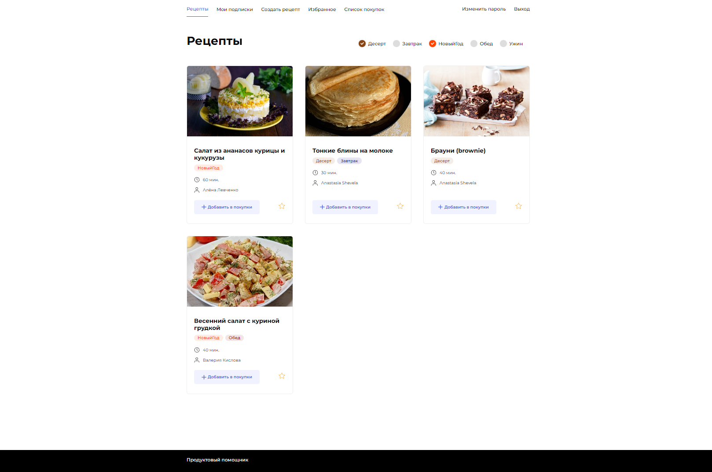
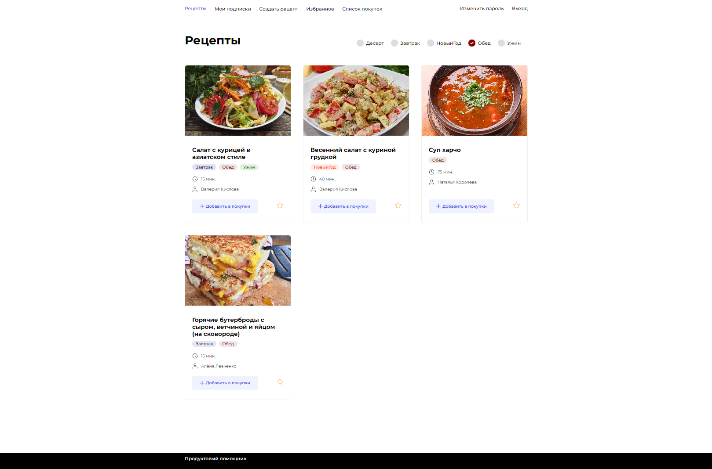
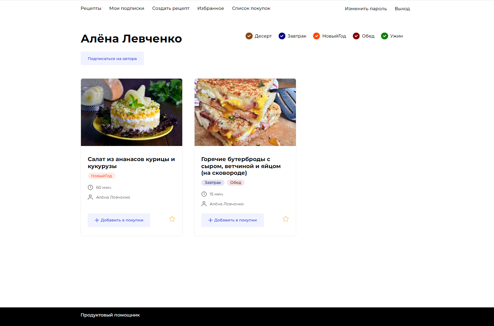
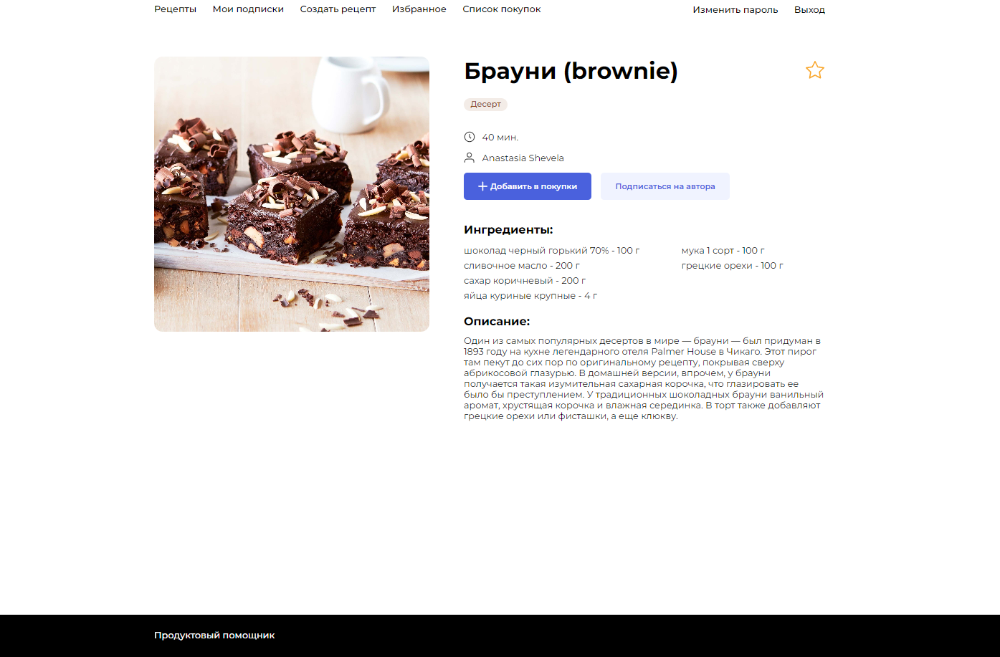
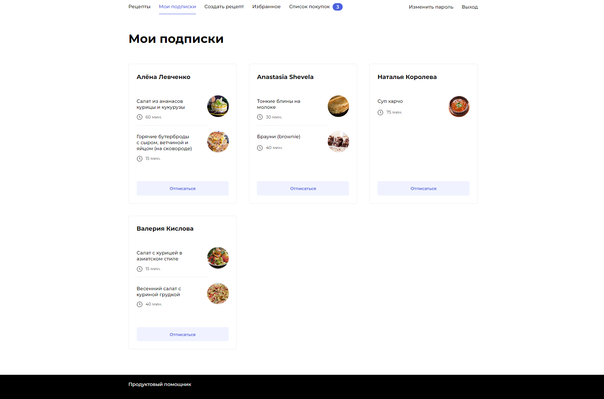
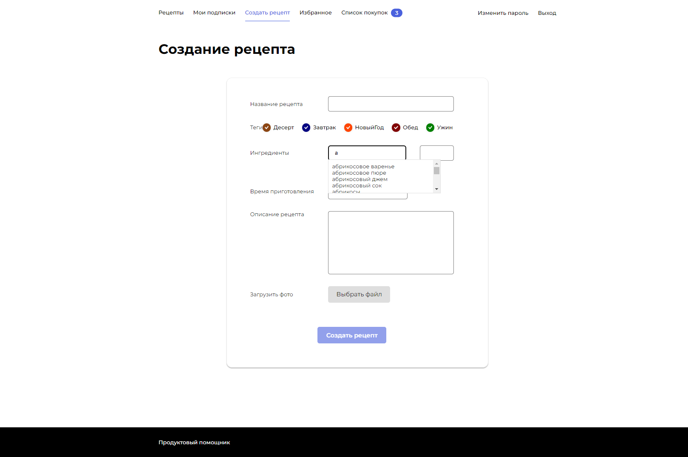
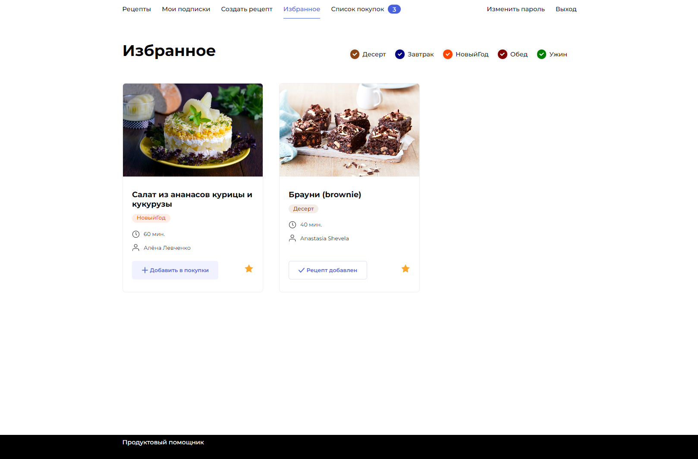
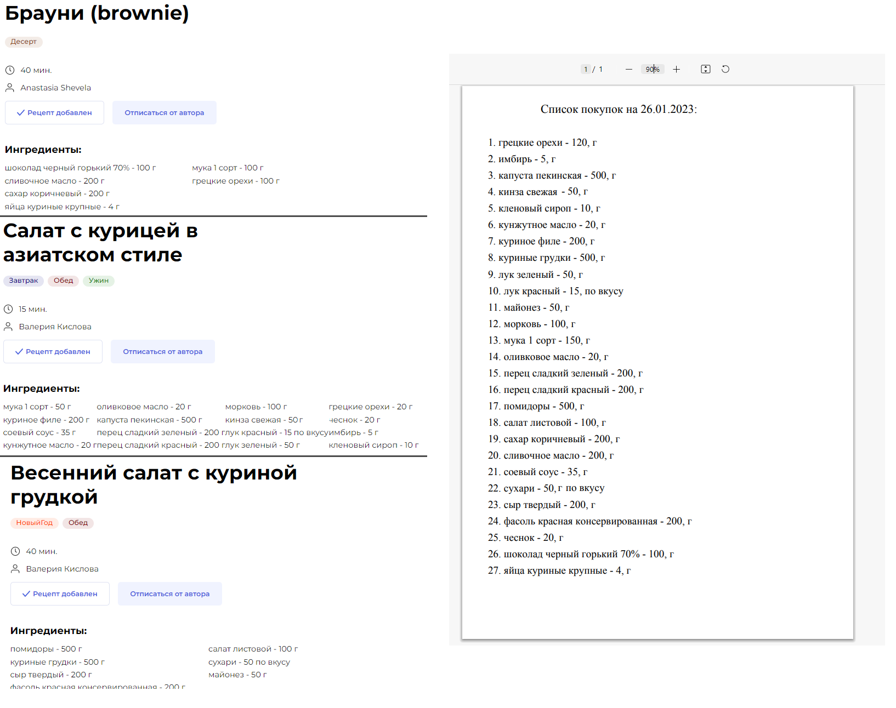

# CookBook - ресурс для публикации рецептов.

Дипломный проект разработанный в рамках учебного курса от Яндекс.Практикум.

**Это** небольшое полноценное **Single Page Application**, написанное на
**React.js** (Frontend) и **Python-Django** (Backend) с базой данных
**PostgreSQL**, **Docker** разворачивает приложение в трёх контейнерах:
Nginx, PostgreSQL и Django+Gunicorn. В рамках учебного курса был настроен
**CI/CD** с помощью **GitHub Actions** с автоматическим запуском на хостинге
**Yandex.Cloud**.

Frontend был подготовлен [командой Яндекс.Практикум](https://github.com/yandex-praktikum/foodgram-project-react)
(закрытый репозиторий, может быть недоступен), моей задачей являлось написание
Backend-части, по техническому заданию, создание инфраструктур и CI/CD
приложения, деплой приложения на удаленный хостинг.

[](https://github.com/wurikavich/cookbook/actions/workflows/main.yml)

## Описание
Проект **Cook Book** - онлайн-сервис и API для него. На этом сервисе
пользователи публикуют свои рецепты, добавляют понравившиеся рецепты в
избранное и подписываться на публикации любимых авторов, а перед походом в
магазин могут скачивать сводный список продуктов в формате pdf, необходимых для
приготовления одного или нескольких выбранных блюд, добавленных в список
покупок.

<details>
<summary><h2>Функционал</h2></summary>

### Пользователи:
- Каждый пользователь имеет свою роль:
    - Анонимный пользователь
    - Аутентифицированный пользователь
    - Администратор
- Получение данных своей учетной записи
- Получение данных пользователя по id
- Получение списка всех пользователей
- Регистрация пользователя
- Изменение пароля своей учетной записи
- Получение токена авторизации
- Удаление токена авторизации

### Подписки:
- Получение списка пользователей, на которых подписан пользователь
- Подписаться на пользователя
- Отписаться от пользователя

### Теги:
- Получение списка всех тегов
- Получение данных тега по id

### Ингредиенты:
- Получение списка всех индентов
- Получение данных ингредиента по id

### Рецепты:
- Получить список всех опубликованных рецептов
- Получение информации о рецепте по id
- Добавление рецепта
- Частичное обновление информации о рецепте
- Удаление рецепта

### Избранные рецепты:
- Добавить рецепт в избранное
- Удалить рецепт из избранного

### Список покупок:
- Скачать pdf-файл со списком необходимых ингредиентов
- Добавить рецепт в список покупок
- Удалить рецепт из списка покупок

</details>

## Настройка и запуск:
Для развертывания проекта необходимо установить и запустить [Docker](https://www.docker.com/products/docker-desktop/).

1. Клонируем репозиторий на локальную машину:
   ```bash
   git clone git@github.com:wurikavich/cookbook.git
   ```

2. В директории infra создаём файл .env, со следующими переменными:
    - Создаём файл:
       ```bash
       cd cookbook\infra                      # Переместились в директорию infra
       nano .env                              # Создали и открыли файл .env
       ```
    - Прописываем переменное окружения в нём. [Сгенерируйте секретный ключ.](https://djecrety.ir/):
       ```bash
       POSTGRES_ENGINE=django.db.backends.postgresql  # указываем, что работаем с postgresql
       POSTGRES_DB=postgres                   # имя базы данных (можете изменить)
       POSTGRES_USER=postgres                 # логин для подключения к базе данных (можете изменить)
       POSTGRES_PASSWORD=postgres             # пароль для подключения к БД (можете изменить)
       POSTGRES_HOST=database                 # название сервиса-контейнера
       POSTGRES_PORT=5432                     # порт для подключения к БД
       SECRET_KEY=                            # секретный ключ Django (вставьте сгенерированный ключ)
       DEBUG=False
       ALLOWED_HOSTS=localhost 127.0.0.1 *    # необходимо при развертывании локально
       ```
    - Сохраняем изменения в файле.

3. Запуск контейнеров Docker. **Внимание** в инструкции показан пример команд
   для Windows, при запуске **на Linux системе**, каждую команду необходимо
   начинать с **sudo**.
    - Из директории infra необходимо выполнить команду:
       ```bash
       docker-compose up -d --build           # Docker начинает разворачивать контейнеры  
       sudo docker-compose up -d --build      # пример команды для Linux систем
       ```
    - Ждем выполнение команды, при успешном выполнении, в терминале должны быть следующии строчки:
       ```bash
       Creating infra_database_1     ... done
       Creating infra_backend_1      ... done
       Creating infra_frontend_1     ... done
       Creating infra_nginx_1        ... done
       ```

4. Запуск django проекта. Из директории infra, выполняем команды:
    - Создаём и применяем миграции:
       ```bash
       docker-compose exec backend python manage.py makemigrations
       docker-compose exec backend python manage.py migrate
       ```
    - Подключаем статику:
       ```bash
       docker-compose exec backend python manage.py collectstatic --no-input
       ```
    - Загружаем подготовленные данный в базу данных проекта:
       ```bash
       docker-compose exec backend python manage.py loaddata data/fixtures.json
       ```     
    - Создаём супер пользователя django:
       ```bash
       docker-compose exec backend python manage.py createsuperuser
       ```

Приведенные выше инструкция по запуску проекта имеют демонстрационную цель.
Запущенный проект находится на [локальном сервере](http://localhost/recipes/).

Документация, запустите сервер и перейдите по ссылке: [http://localhost/api/docs/](http://localhost/api/docs/).

Панель администратора: [http://localhost/admin/](http://localhost/admin/).

## Примеры запросов на эндпоинты
### Регистрация нового пользователя:
#### Запрос
```bash
POST - 'http://localhost/api/users/'
```
```yaml
{
  "username": "user_username.",
  "email": "user@mail.ru",
  "password": "user_password.",
  "first_name": "user_first_name",
  "last_name": "user_last_name"
}
```

#### Ответ
```yaml
{
  "id": 2,
  "username": "user_username.",
  "email": "user@mail.ru",
  "first_name": "user_first_name",
  "last_name": "user_last_name"
}
```

### Получение токена:
#### Запрос
```bash
POST - 'http://localhost/api/auth/token/login/'
```
```yaml
{
  "password": "user_password.",
  "email": "user@mail.ru"
}
```

#### Ответ
```yaml
{ "auth_token": "token_value" }
```

### Получение данных своей учетной записи:
#### Запрос
```bash
GET - 'http://localhost/api/users/me/'
header 'Authorization: Token "token_value"'
```

#### Ответ
```yaml
{
  "id": 2,
  "username": "user_username.",
  "email": "user@mail.ru",
  "first_name": "user_first_name",
  "last_name": "user_last_name",
  "is_subscribed": false
}
```

### Добавление нового рецепта:
#### Запрос
```bash
POST - 'http://localhost/api/recipes/'
header 'Authorization: Token "token_value"'
```
```yaml
{
  "ingredients": [
    {
      "id": 11,
      "amount": 270
    },
    {
      "id": 38,
      "amount": 2
    },
    {
      "id": 267,
      "amount": 30
    },
  ],
  "tags": [
    1,
    2
  ],
  "image": "data:image/png;base64,iVBORw0KGgoAAAANSUhEUgAAAAEAAAABAgMAAABieywaAAAACVBMVEUAAAD///9fX1/S0ecCAAAACXBIWXMAAA7EAAAOxAGVKw4bAAAACklEQVQImWNoAAAAggCByxOyYQAAAABJRU5ErkJggg==",
  "name": "Кофе с молоком",
  "text": "Вкусные и полезные напитки можно приготовить в домашних условиях.",
  "cooking_time": 15
}
```

#### Ответ
```yaml
{
  "id": 4,
  "tags": [
    {
      "id": 1,
      "name": "Завтрак",
      "color": "#E26C2D",
      "slug": "breakfast"
    },
    {
      "id": 2,
      "name": "КофейноеУтро",
      "color": "#0000CD",
      "slug": "KofeinoeUtro"
    }
  ],
  "author": {
    "id": 2,
    "username": "user_username.",
    "email": "user@mail.ru",
    "first_name": "user_first_name",
    "last_name": "user_last_name",
    "is_subscribed": false
  },
  "ingredients": [
    {
      "id": 11,
      "name": "Вода кипяченная",
      "measurement_unit": "мл",
      "amount": 270
    },
    {
      "id": 38,
      "name": "Кофе молотый",
      "measurement_unit": "ч. ложка",
      "amount": 2
    },
    {
      "id": 267,
      "name": "Молоко 2,5%",
      "measurement_unit": "мл",
      "amount": 30
    }
  ],
  "is_favorited": false,
  "is_in_shopping_cart": false,
  "name": "Кофе с молоком",
  "image": "http://localhoct/media/recipes/images/20223/01/26/koffe.jpeg",
  "text": "Вкусные и полезные напитки можно приготовить в домашних условиях.",
  "cooking_time": 15
}
```

## Стек технологий
### Backend:
- Python 3.10
- Django 3.2.17
- Django REST Framework 3.14.0

### Инфраструктура для запуска:
- Docker-compose
- Nginx
- Gunicorn
- PostgreSQL
- GitHub Actions
- Yandex.Cloud

## Разработчики
- [Александр Гетманов](https://github.com/wurikavich) - Backend
- [Яндекс.Практикум](https://github.com/yandex-praktikum/foodgram-project-react) - Frontend

<details>
<summary><h2>Изображение запущенного приложения</h2></summary>












</details>